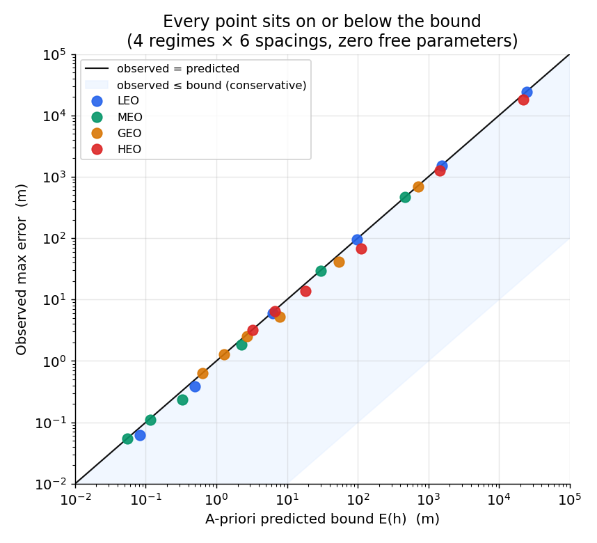
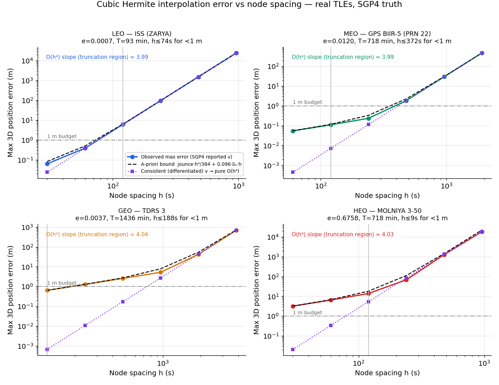
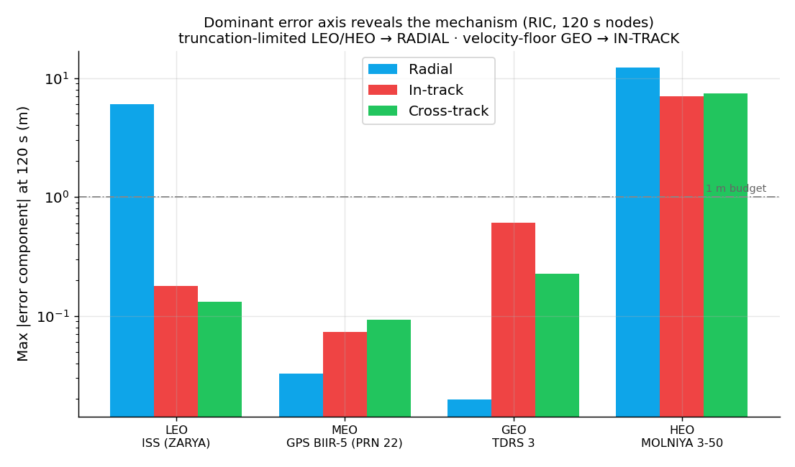
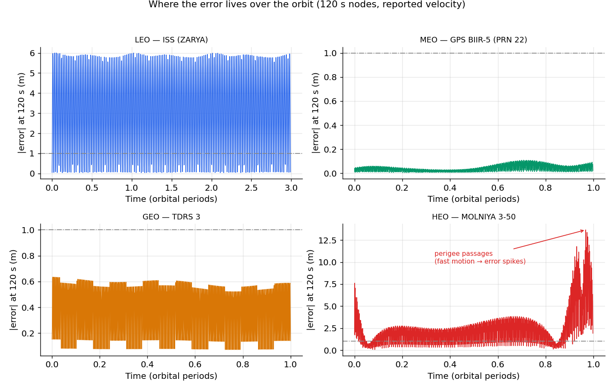
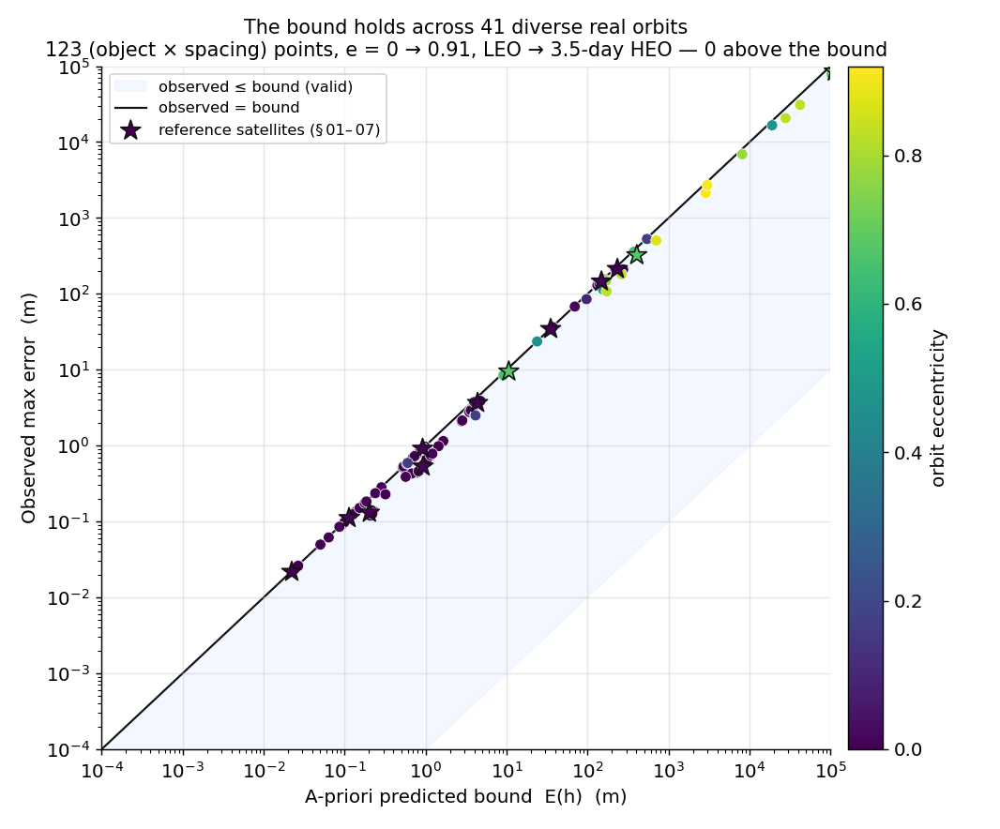
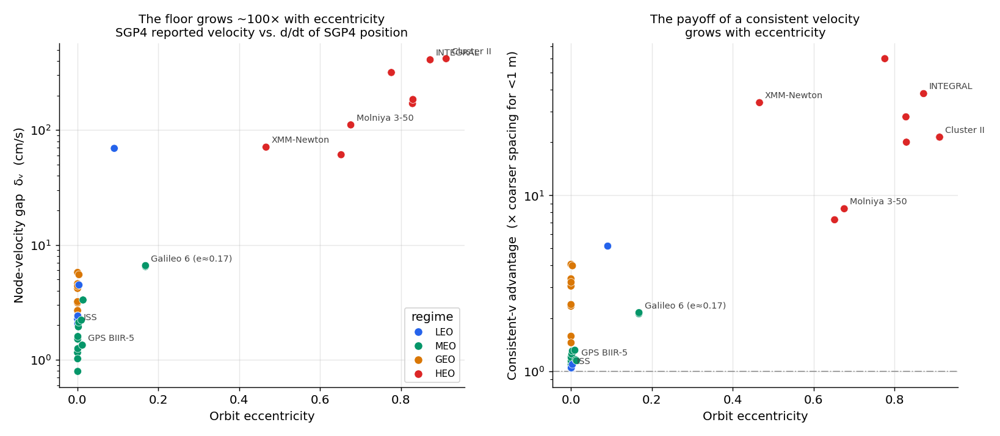

# SGP4 Orbit Interpolation — Cubic Hermite Error Validation

**Is piecewise cubic Hermite interpolation of ephemeris nodes an acceptable — and
*boundable* — way to reconstruct an orbit between nodes?** This repo answers that
with a reproducible study on **real satellites** across four orbit regimes, using
SGP4 as *both* the node source and the dense truth reference. Because the same
propagator produces the nodes and the truth, it isolates **interpolation** error
with zero force-model mismatch — the "state vectors with 0 % uncertainty" case.

> This README is generated from the same data as the full report
> (`report.html`) by `build_readme.py`, so every number here is exact.

---

## Verdict

Cubic Hermite is an excellent, provably **O(h⁴)** interpolant for orbital motion —
every regime confirms the fourth-order law. Whether the nominal **120 s / <1 m**
target is met depends on the regime, and the required spacing follows directly
from the a-priori bound below.

| Regime | Satellite | e | Period (min) | max err @ 120 s | vs 1 m | O(h⁴) slope | h≤ for <1 m (SGP4 v) | h≤ (consistent v) |
|---|---|--:|--:|--:|:--:|--:|--:|--:|
| **LEO** | ISS (ZARYA) | 0.0007 | 93 | 6.00 m | ⚠️ refine | 3.99 | 74 s | 77 s |
| **MEO** | GPS BIIR-5 (PRN 22) | 0.0120 | 718 | 0.11 m | ✅ pass | 3.99 | 372 s | 413 s |
| **GEO** | TDRS 3 | 0.0037 | 1,436 | 0.63 m | ✅ pass | 4.04 | 188 s | 748 s |
| **HEO** | MOLNIYA 3-50 | 0.6758 | 718 | 13.93 m | ⚠️ refine | 4.03 | 9 s | 79 s |

*"refine" = boundable and understood, just needs finer nodes than 120 s for a
strict 1 m budget. Even the worst case here (13.93 m, Molniya) is far
below SGP4's own ~1–3 km state uncertainty — Hermite is not the dominant error
source in an SGP4 pipeline.*

---

## 1 · Why Hermite, and how it was tested

SGP4 returns **position *and* velocity** at each epoch, so we build a genuine
two-point cubic Hermite interpolant on every interval — matching position and
velocity exactly at both ends (C¹ continuous), not a position-only spline. On an
interval [t₀, t₁] with h = t₁−t₀ and s = (t−t₀)/h:

```
p(t) = h₀₀(s)·p₀ + h₁₀(s)·h·v₀ + h₀₁(s)·p₁ + h₁₁(s)·h·v₁
```

The interpolation uses SciPy's standard `CubicHermiteSpline` (reproduces the
basis above to ~10⁻⁹ m), so "is the interpolant coded correctly?" is not in
question. *(`PchipInterpolator` is **not** equivalent — it discards the supplied
derivatives; we deliberately feed SGP4's velocities.)* Truth is SGP4 sampled
densely inside every interval; error is the 3D position difference (max and RMS),
also decomposed into the radial / in-track / cross-track (RIC) frame.

---

## 2 · The bound — a two-term law with zero free parameters

Across every regime and spacing, the observed maximum error is captured by the
sum of two analytic terms, **both computed directly from the SGP4 states** —
nothing fitted:

```
E(h) =  max|jounce| · h⁴ / 384   +   0.0962 · δᵥ · h
        └── truncation, O(h⁴) ──┘     └ node-velocity floor, O(h) ┘
```

- **Truncation** — the exact cubic-Hermite remainder; *jounce* is the 4th time
  derivative of position, set by the orbit dynamics.
- **Node-consistency floor** — SGP4's *reported* velocity is not exactly the
  derivative of its *reported* position; the gap δᵥ, fed in as the Hermite
  slope, injects an O(h) term (coefficient 0.0962 = maxₛ|2s³−3s²+s|).

Because both inputs come from the propagator, **E(h) is a genuine a-priori bound,
not a curve fit** — and every test point lands on or below it.



---

## 3 · Convergence — fourth order, exactly as predicted

Halving the node spacing cuts truncation error ~16×. Fitted log-log slopes:
**3.99** (LEO), **3.99** (MEO),
**4.04** (GEO), **4.03** (HEO) —
all essentially the theoretical 4.0.



*Solid: observed error (SGP4 reported velocity). Dashed: the a-priori bound E(h).
Dotted: the same interpolation from a consistent (differentiated) velocity —
pure O(h⁴) with the floor removed (§4).*

---

## 4 · Which velocity you feed the nodes

The one caveat. SGP4's reported velocity isn't exactly d/dt of its reported
position — the gap δᵥ is **2.0 cm/s** for the ISS,
**5.5 cm/s** for GEO, and **1.11 m/s** at Molniya
perigee. Feeding it as the Hermite slope injects the O(h) floor.

> **Intuition.** Picture connecting dots with a smooth curve while, at each dot,
> an arrow tells you which way to head. If the arrow points slightly off from the
> way the dots trend, the curve bows away between dots. SGP4's reported velocity
> is such a slightly-off arrow; the error it injects grows *linearly* with spacing.

The fix — a **consistent velocity** — sets each node's slope by *differentiating
SGP4's position*. The floor vanishes and pure O(h⁴) returns:

| Regime | SGP4 reported v @ 120 s | consistent v @ 120 s | improvement |
|---|--:|--:|--:|
| **LEO** | 5.999 m | 5.9771 m | ×1.0 |
| **MEO** | 0.110 m | 0.0071 m | ×15 |
| **GEO** | 0.635 m | 0.0007 m | ×961 |
| **HEO** | 13.927 m | 5.3788 m | ×2.6 |

Consistent velocity is a big lever where the floor dominates (GEO, MEO) and does
little where truncation already dominates (LEO). *Trade-off:* the interpolated
velocity at nodes no longer equals SGP4's reported velocity — fine for position
lookup, a conscious choice if a consumer reads velocity out of the ephemeris. If
nodes come from a numerical integrator (where v genuinely is dr/dt), the floor
doesn't exist at all.



*The dominant error axis fingerprints the mechanism: truncation-limited orbits
(LEO, HEO) err **radially** (jounce points along the radius for near-circular
motion); the velocity floor (GEO) errs **in-track**, along the velocity direction.*

---

## 5 · Where the error lives

On near-circular orbits the per-interval error is nearly stationary around the
orbit. On the eccentric Molniya orbit it concentrates at the **perigee passages**,
where curvature and speed spike — exactly where fixed-step interpolation struggles
and where adaptive refinement pays off.



---

## 6 · Robustness across the catalog

The four reference satellites make the mechanism legible, but the bound is
analytic and *per object* — so the real test is diversity, not count (50 more
Starlinks would prove nothing). From **985** real objects pulled
across 13 Celestrak groups, **41** were selected to span orbital
period (LEO to a 3.5-day deep-space orbit) and — the variable that
matters most — eccentricity, from **0.0002** to **0.91** (Cluster II).

**Result: all 123 (object × spacing) points sit on or below the
bound** — worst observed/predicted = 0.996, with
0 above it and 0 objects skipped.



Sweeping by eccentricity shows *why* Molniya was the hard case, and generalizes
it: the velocity gap δᵥ climbs roughly **100×** from near-circular (~1 cm/s) to
e ≈ 0.9 (several m/s) — and the coarser spacing a consistent velocity buys you
*grows* with eccentricity.



---

## 7 · The bound, term by term (at 120 s)

| Regime | max\|jounce\| (m/s⁴) | δᵥ (cm/s) | truncation (m) | floor (m) | E(h) pred (m) | observed (m) | obs/pred |
|---|--:|--:|--:|--:|--:|--:|--:|
| **LEO** | 1.11×10⁻⁵ | 2.02 | 6.009 | 0.233 | 6.242 | 5.999 | 0.96 |
| **MEO** | 1.32×10⁻⁸ | 0.95 | 0.007 | 0.109 | 0.116 | 0.110 | 0.94 |
| **GEO** | 1.23×10⁻⁹ | 5.51 | 0.001 | 0.637 | 0.637 | 0.635 | 1.00 |
| **HEO** | 1.00×10⁻⁵ | 110.93 | 5.404 | 12.810 | 18.214 | 13.927 | 0.76 |

Both bound inputs come straight from the SGP4 states; obs/pred ≤ 1 in every row
confirms E(h) is a valid upper bound.

---

## 8 · Recommendations — set node spacing from the bound

- **LEO, strict 1 m:** use **≤ 74 s**
  (60 s gives 0.38 m). The 120 s point is
  truncation-limited at 6.00 m — a consistent velocity
  doesn't rescue it; only finer h does.
- **MEO & GEO:** 120 s already meets 1 m
  (0.11 m and 0.63 m). GEO is
  floor-limited — for deep sub-meter, switch to a consistent velocity rather than
  spending nodes.
- **Molniya / HEO:** uniform spacing is the wrong tool — error concentrates at
  perigee. Use a consistent velocity and/or refine near perigee.
- **Always size h from E(h):** compute max|jounce| and δᵥ from the states and
  solve E(h) = budget. No trial-and-error, no per-mission re-tuning.

---

## 9 · Reproduce

```bash
python -m venv .venv && .venv/bin/pip install numpy scipy sgp4 matplotlib
.venv/bin/python validate_hermite.py   # 4 reference sats -> data/results.json
.venv/bin/python population.py         # 41-object catalog -> data/population.json
.venv/bin/python make_plots.py         # -> plots/*.png
.venv/bin/python build_report.py       # -> report.html
.venv/bin/python build_readme.py       # -> README.md (this file)
```

## Layout

| Path | What |
|------|------|
| `validate_hermite.py` | Core validation + full derivation of the bound (module docstring). Interpolation via SciPy `CubicHermiteSpline`. |
| `population.py` | Catalog-wide robustness check over `data/population.tle`. |
| `make_plots.py` | All figures in `plots/`. |
| `build_report.py` / `build_readme.py` | Assemble `report.html` / this `README.md` from the JSON. |
| `data/tles.txt` | The 4 reference TLEs (real, from Celestrak). |
| `data/population.tle` | The 41 diverse objects (selection rule in the file header). |
| `report.html` | Self-contained rendered report (figures + tables + methodology). |

TLEs fetched from [Celestrak](https://celestrak.org) on 2026-08-06.

